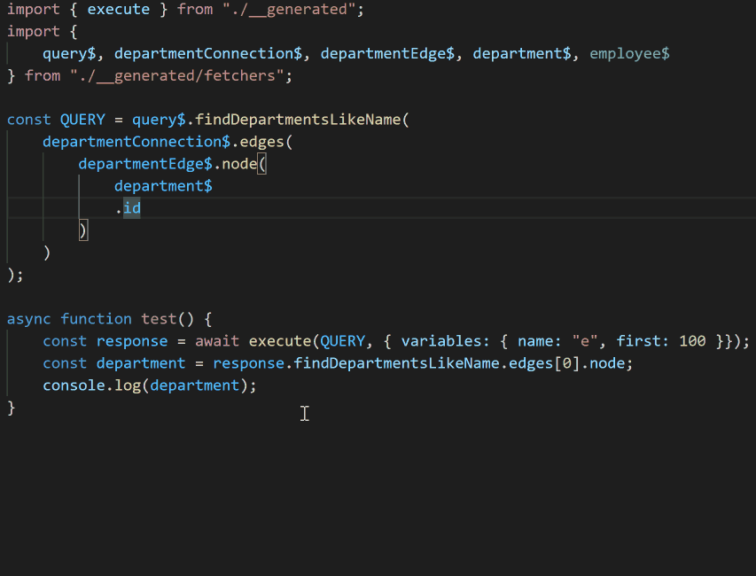

A new GraphQL client for TypeScript. it's TypeScript-DSL for GraphQL with full features.

1. Supports GraphQL queries with strongly typed code.
2. **Automatically infers the type of the returned data according to the strongly typed query request**, This is the essential difference between this framework and other similar frameworks, and it is also the reason why I created it.
3. Because of point 2, unlike other client-side code generation tools and relay-compiler, **the code generation work is one-time**. Once the code is generated, it can be developed continuously until the server interface changes, without the need to generate code again and again.

# Null & Undefined
For a long time, null and undefined have led to the differentiation of JavaScript/TypeScript development. This framework eliminates null and uniformly adopts undefined which is more friendly to TypeScript.

# Get started

You can choose any of the following 4 ways

- [Step-by-step guide with nothing](get-start-async.md)
- [Step-by-step guide with apollo-client](get-start-apollo.md)
- [Step-by-step guide with relay](get-start-relay.md)
- [Step-by-step guide with graphql-state](get-start-graphql-state.md) **(Suggested)**

   [graphql-state](https://github.com/babyfish-ct/graphql-state) is a collaborative framework tailored for graphql-ts-client, and is a complete react state management framework.
   
   - [graphql-state](https://github.com/babyfish-ct/graphql-state) is very smart. 
The essence of UI state is that one main mutation causes N extra mutations, the more complex the UI, the larger the N. graphql-state allows developer only focus on main mutation, all the extra mutations will be executed automatically. Compare with Apollo Client and Relay, after mutation, you neither need to update other affected data in the cache, nor need to determine which queries will be affected and need to be refetched.
   - [graphql-state](https://github.com/babyfish-ct/graphql-state) can map the REST service to GraphQL service on client-side, access REST service with GraphQL semantics, and enjoying syntactic sugar provided by graphql-ts-client.

# Documentation
[English Documentation](doc/README.md) | [中文文档](doc/README_zh_CN.md)

# Notes
> *My npm packages are 'graphql-ts-client-api', 'graphql-ts-client-codegen' and 'graphql-ts-client-relay'. There is another package named 'graphql-ts-client' in npm repository, but that's not my framework.*

# Other projects:
[graphql-provider](https://github.com/babyfish-ct/graphql-provider): GraphQL server-side rapid development framework, if users use RDBMS to manage persistent data, it can help users to quickly build GraphQL services in the shortest time (based on kotlin and R2DBC)
